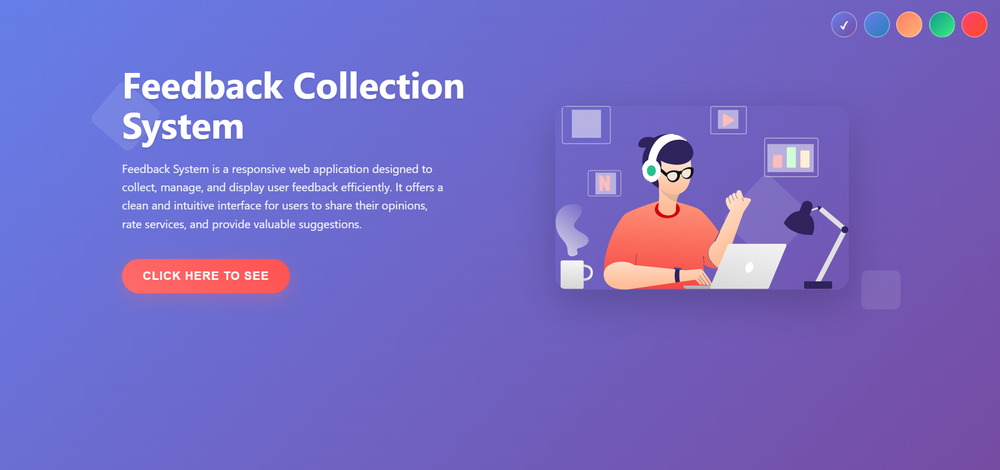
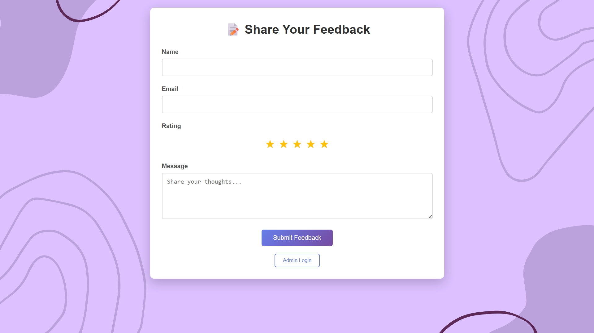
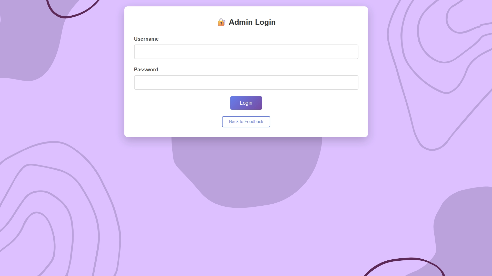
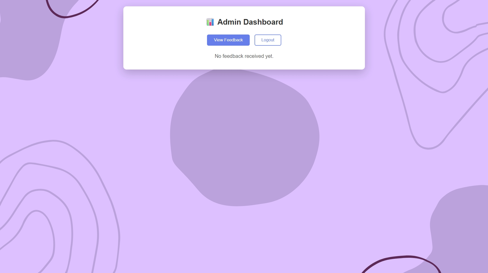

# 📝 Feedback Collection System

A responsive, full-stack **Feedback Collection Web App** that enables users to submit feedback and allows admins to manage it securely. Built using **HTML, CSS, JavaScript, Node.js, Express, and MongoDB**, this system is perfect for collecting insights from users, customers, or clients.

---
## 🌟 Features

### ✅ User Interface
- 📄 Submit feedback with name, email, message, and star rating.
- ⭐ Interactive star-based rating system.
- 📱 Fully responsive design with mobile support.
- 🎨 Theme switching and animated transitions.
- 🎬 Loading screens and button animations.

### 🔐 Admin Panel
- 🔐 Secure login with JWT-based authentication.
- 📋 View all submitted feedback.
- 🗑️ Delete inappropriate or duplicate feedback.
- 📈 Feedback sorting by date (latest first).

---

## 🔧 Technologies Used

| Layer       | Tech Stack                                      |
|-------------|-------------------------------------------------|
| **Frontend**| HTML5, CSS3, JavaScript (Vanilla)               |
| **Backend** | Node.js, Express.js                             |
| **Database**| MongoDB (via Mongoose)                          |
| **Security**| bcryptjs, jsonwebtoken                          |
| **Dev Tools**| nodemon, dotenv                                |
| **Deployment**| [Railway](https://railway.app/)               |

---

## 🖼️ Screenshots

### 🎉 Landing Page

### ✍️ Feedback Form

### 🔐 Admin Login

### 📊 Admin Dashboard

**Contributors:**

1. Raj Vardhan Singh - rajvardhan75 - raj2006.vs@gmail.com
2. Arjun Khishor - arjunirdande - irdandearjun@gmail.com
3. Arya Arvind Dalvi - Aryadalvi03 - dalviarya03@gmail.com
4. P Sathvik Reddy - Sathvik2954 - reddysathvik2005@gmail.com
5. Ajil P R - Ajil017 - ajilpr2005@gmail.com

---

## 🚀 Getting Started

### Prerequisites
- Node.js and npm installed
- MongoDB instance (local or [MongoDB Atlas](https://www.mongodb.com/cloud/atlas))
- Git (for cloning)

### 📁 Project Structure

├── index.html              # Landing page
├── feedback.html           # Feedback and admin dashboard
├── server.js               # Express server
├── package.json            # Node dependencies
├── .gitignore
└── public/
    ├── background.svg
    ├── illustration.svg

## 🌍 Deployment
You can deploy this project using services like:

Railway

Render

Vercel (Frontend)

Heroku

## 📄 License
This project is licensed under the MIT License.
Feel free to fork, modify, and contribute!
